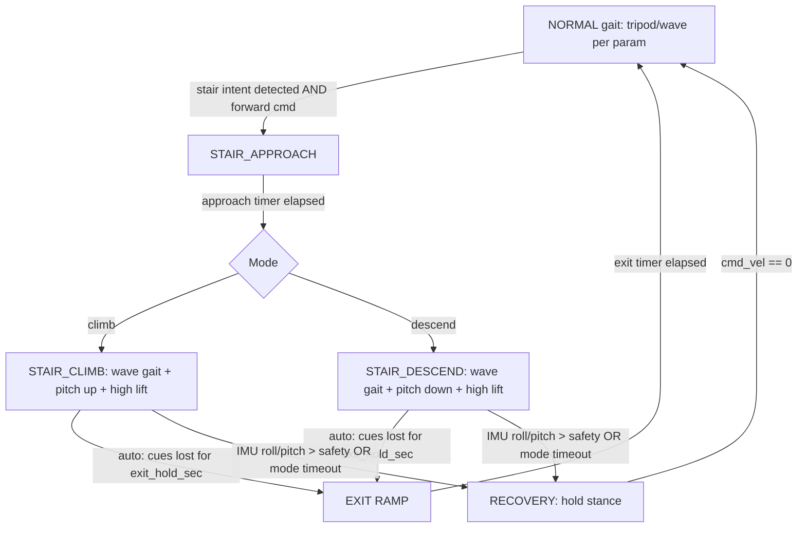

# Hexapod Stair-Climbing Algorithms and ROS 2 Integration for a Freenove-Based Hexapod

## Executive Summary

Stair climbing with small, low-cost hexapod robots tends to succeed via two broad strategies:

- **Perception-to-action learned policies** that perceive upcoming geometry (typically with depth) and output joint targets directly.
- **Quasi-static, high-stability stair modes** (often wave/creep gaits) triggered by simple sensing (range/contact/tilt), with deliberate posture changes that keep the support polygon large.

The arXiv paper you prioritized (*Versatile Locomotion Skills for Hexapod Robots*) is a strong example of the first strategy: a **teacher–student** pipeline trains in simulation with privileged information (height maps + joint feedback) and distills to a student that uses only **egocentric depth images + VIO pose**, deployable on low-cost hardware without real-time joint state feedback. citeturn18view0turn2view0

Given your current reality (Freenove kit, Pi 4 assumed, tripod gait today, IMU publishing but lightly used), the fastest path to a working stair-climber (without committing to a full ML stack and new sensors) is a **conservative “stair mode”** that switches from tripod to a **wave/creep stair gait** with higher leg clearance and a pitched body. This aligns with classic stair-traversal experience where wave gaits are favored over alternating tripod on stairs due to stability and reliability. citeturn17view0

This report includes: (a) a top-4 algorithm comparison, (b) a technical walkthrough of the best-fit algorithm for your current stack, (c) a concrete ROS 2 integration plan plus a `locomotion.py` patch (stair detection + state machine + `climb_stairs()` / `descend_stairs()`), (d) calibration and safety checks, and (e) a test plan and metrics.

## Current System Baseline

Here is what is concretely known about your project from the information provided and your uploaded `locomotion.py`:

Your locomotion node is an open-loop gait generator that computes stance points, advances a gait cycle, converts foot positions into per-leg joint targets via inverse kinematics, and publishes them as a `JointState` to `servo_targets`. fileciteturn0file0L190-L214

**ROS IO today (as implemented):** the node subscribes to `cmd_vel` (Twist), `body_pose` (Vector3), `body_shift` (Vector3), and optionally `imu/data_raw` (Imu). It publishes `servo_targets` (JointState). fileciteturn0file0L122-L168

**Gaits today:** it supports at least `tripod` and `wave` gaits, controlled by parameters, with a `GaitCycleState` that advances per control tick. fileciteturn0file0L70-L88

**IMU today (present but likely underutilized):** the IMU callback estimates roll/pitch from acceleration (atan2). That estimate is only applied to gait through `balance_gain` inside `commanded_body_pose()`; with `balance_gain = 0.0` (your default), the gait ignores IMU. fileciteturn0file0L182-L258

**Validation today:** it checks leg workspace based on the Euclidean leg length and blocks publishing when targets are outside a [90 mm, 248 mm] window. fileciteturn0file0L404-L435

This baseline is well suited to integrating a stair mode because you already (1) have a stable timing loop, (2) support a wave gait variant that can be leveraged for quasi-static stair climbing, and (3) have at least an IMU feed that can be turned into a safety abort signal.

## Research Landscape of Hexapod Stair-Climbing

Per *Versatile Locomotion Skills for Hexapod Robots*, the high-performance state-of-the-art pattern for low-cost hexapods is to learn a **direct locomotion policy** that uses egocentric depth and pose to generate joint commands, trained with a teacher that has privileged simulation information and distilled to a deployable student. citeturn18view0turn2view0 The paper states that training uses simulation-only data and that deployment does not require real-time joint state feedback. citeturn18view0turn2view0 It also describes a curriculum for stairs with risers increasing from 4.5 cm to 18 cm and treads decreasing in depth, plus domain randomization meant to improve robustness. citeturn2view0 Their physical stair tests were performed on staircases around entity["organization","University of California, Berkeley","public university berkeley, ca, us"] and they report step completion counts and real-world failure modes (e.g., last-step issues when stairs are no longer in view). citeturn2view1

A widely deployed “engineering” alternative (especially for small kits) is to use a **quasi-static stair mode**: increase clearance, slow down, and use a wave/creep gait so that 4–5 legs can remain in support most of the time. Wave gaits are repeatedly cited in stair-climbing practice and reviews of legged stair-climbers. citeturn4view3

Bio-inspired literature further emphasizes that step/obstacle climbing success depends strongly on knowing (or learning) *when* to initiate posture changes and climbing motions relative to the obstacle. In Goldschmidt et al.’s adaptive obstacle negotiation controller for hexapods, learning is explicitly used to determine an appropriate distance-to-obstacle for initiating a climbing posture; their system uses front ultrasonic sensors to generate early/predictive and late/reflex signals and combines this with posture control and leg reflexes. citeturn13view0

Classic stair-climbing experience from RHex development is also directly relevant to your constraints—low sensing, strong reliance on gait choice and mechanics. In entity["people","Edward Z. Moore","robotics engineer"]’s stair controller thesis at entity["organization","McGill University","research university montreal, ca"], the controller is tested on multiple stair flights and reports very high empirical reliability; importantly, it notes a wave gait choice for stair traversal and cites poor performance for alternating tripod on stairs. citeturn17view0

image_group{"layout":"carousel","aspect_ratio":"16:9","query":["hexapod robot climbing stairs","RHex robot stair climbing","hexapod robot obstacle negotiation ultrasonic sensors AMOS II","small hexapod depth camera stair climbing"],"num_per_query":1}

## Candidate Algorithms Comparison

The table below compares four stair-climbing approaches that are realistically “closest” to your Freenove-class hexapod constraints. Suitability scores are heuristic for your current situation (Pi 4 assumed, no extra sensors confirmed, open-loop servos).

| Algorithm name | Source/paper | Required sensors | Required DOF/actuation | Computational needs | Robustness to step height/irregularity | Pros/cons | Suitability (1–10) |
|---|---|---|---|---|---|---|---|
| Teacher–student perceptive RL policy (depth + VIO → direct joint angles) | *Versatile Locomotion Skills for Hexapod Robots* (arXiv:2412.10628) citeturn18view0turn2view0 | Depth camera + VIO pose (tracking camera) citeturn18view0turn2view0 | Outputs joint targets; deployable without real-time joint state feedback citeturn18view0turn2view0 | Heavy training; inference shown on low-cost compute citeturn2view0turn2view1 | High within trained envelope (curriculum up to 18 cm risers, tread randomization) citeturn2view0 | Pro: anticipatory, robust. Con: extra sensors + ML stack, perception failure modes (e.g., last step) citeturn2view1 | 6 now, 9 with depth+VIO |
| Range-triggered, IMU-anchored stair mode (approach posture ramp → wave/creep climb) | Bio-inspired step/obstacle negotiation: range-triggered initiation + posture adaptation citeturn13view0turn17view0 | IMU + simple front range (ultrasonic/IR). Optional foot contact. citeturn13view0 | 18-DOF helps (posture + clearance + careful placement) | Low compute (state machine + IK) | Medium–high on regular stair geometry; degrades without contact/perception on irregular steps | Pro: minimal hardware, explainable tuning, ROS-friendly. Con: open-loop foot placement uncertainty without contact sensing | 8 |
| Reactive CPG + leg reflexes + learned trigger distance (ultrasonic CS/UCS) | Goldschmidt et al. 2014 + related work citeturn13view0turn4view0 | Front ultrasonics + foot contact signals; posture control citeturn13view0 | Works on multi-DOF hexapods; needs contact/reflex channel for best results citeturn13view0 | Low (CPG + simple learning rule) citeturn13view0 | High obstacle/step robustness if contact/reflex channel exists; reported up to ~75% leg length real citeturn13view0 | Pro: closed-loop reflexes improve reliability. Con: you likely need to add contact sensing or emulate it | 7 |
| Open-loop geometry-informed quasi-static wave stair traversal | RHex stair controller (Moore thesis) citeturn17view0 | None strictly; IMU recommended for safety | Very low requirements in classic RHex; Freenove can implement a higher-clearance analog with 3-DOF legs | Very low | Medium on uniform stairs; brittle on unexpected geometry without sensing | Pro: simplest to implement; wave gait favored over tripod for stairs citeturn17view0. Con: tuning-heavy, little adaptation | 6 |

## Selected Best Algorithm and Technical Walkthrough

### Why this is the best fit right now

For your current platform and software baseline, the best payoff-per-effort is the **Range-triggered, IMU-anchored stair mode using a wave/creep gait**. It fits your node’s architecture (gait cycle + stance point generation) and matches established stair practice: choosing wave gait for stairs because alternating tripod can be unreliable in stair traversal contexts. citeturn17view0

This does not preclude the arXiv RL approach; it positions you to add a depth+VIO “policy mode” later if you decide to invest in exteroception and training. citeturn18view0turn2view0

### How it works step-by-step

The controller is a **finite-state supervisor** layered above your existing gait engine:

**Approach**
1) Detect likely stairs/step ahead (range threshold, step estimator, or IMU heuristic).  
2) Switch to a high-stability gait (wave/creep).  
3) Ramp posture to a climb-ready configuration:
   - raise body (increase ground clearance),
   - pitch up for ascent or pitch down for descent.

This aligns with bio-inspired findings that the “distance-to-obstacle where climbing begins” is a key parameter and can be learned/adapted using front range cues. citeturn13view0

**Active**
4) Execute slow, forward-only wave gait with increased swing clearance.  
5) Keep monitoring: (a) IMU roll/pitch safety, (b) whether stair cues persist (for auto exit), and (c) timeouts to avoid infinite attempts.

**Exit**
6) Ramp posture back to nominal stance and return to normal gait.

### Required sensor fusion (by sensor tier)

**Minimum tier (IMU + optionally ultrasonic)**  
- IMU provides roll/pitch for safety abort and mild posture stabilization. In your current node, roll/pitch are computed from accelerometer only; this can be noisy during motion unless you later fuse gyro + accel. fileciteturn0file0L182-L258  
- Ultrasonic range provides a simple “step face nearby” cue (threshold + freshness timeout), consistent with bio-inspired controllers that use ultrasonic signals as predictive/reflex cues. citeturn13view0  

**Optional tier (depth/stereo step estimator)**  
- A separate vision node computes step direction (+up / -down) and publishes a compact `Vector3` step info message to the locomotion node. This keeps the locomotion node lightweight while enabling the perception pathway used in the arXiv approach (depth + pose). citeturn18view0turn2view0  

**Recommended tier (foot contact / tactile)**  
- A contact channel (microswitches, pressure sensors, or motor-current inference) enables “foot landed vs missed” reflexes. Bio-inspired and tactile approaches gain robustness by using contact/reflex signals; tactile-sensor work explicitly uses leg-mounted tactile sensing and learned prediction to overcome obstacles near robot height. citeturn13view0turn4view2  

### Failure modes and mitigations

- **Missed foothold without contact sensing** → mitigate by higher swing clearance, slower gait, and adding a contact channel if possible. citeturn13view0turn4view2  
- **Torque/battery sensitivity** → mitigate by lowering speed, increasing stance stability, and monitoring supply (the arXiv paper reports performance degradation at lower supplied voltage). citeturn2view1  
- **False stair detection** (ultrasonic reflections) → mitigate by freshness timeouts, hysteresis, and requiring forward motion + low yaw before entering stair mode. citeturn13view0  
- **Tip-over** → wave gait + IMU abort thresholds + “recovery hold” state. citeturn17view0  

## ROS 2 Integration Plan, Code Patch, and Validation

### Topics, message types, and rates

Existing topics (already in your node):  
- `cmd_vel`: `geometry_msgs/Twist` (recommend 20–50 Hz; your node already runs its own loop) fileciteturn0file0L122-L168  
- `imu/data_raw`: `sensor_msgs/Imu` (≥50 Hz recommended for good tilt safety) fileciteturn0file0L182-L188  
- `servo_targets`: `sensor_msgs/JointState` (published at `control_rate_hz`) fileciteturn0file0L404-L429  

Added topics in the patch (configurable by parameters):  
- `stair_mode`: `std_msgs/String` (`"off" | "auto" | "climb" | "descend"`)  
- `stair_range`: `sensor_msgs/Range` (ultrasonic distance; 10–30 Hz is sufficient)  
- `stair_step_info`: `geometry_msgs/Vector3` (`x = step_height_mm`, `z = confidence`; 5–15 Hz is sufficient)

### Behavior switching flowchart



### Pseudocode for stair detection and the two behaviors

**Stair intent detection (AUTO)**

```
if stair_mode_cmd in {"climb","descend"}:
    intent = stair_mode_cmd
else if cmd_vel.x <= 0 or abs(cmd_vel.yaw) too large:
    intent = None
else:
    if step_info fresh AND confidence high:
        intent = "climb" if step_height_mm > 0 else "descend"
    else if range fresh AND range < detect_range:
        intent = "climb"   # conservative: treat as step-up/obstacle
    else if imu_pitch exceeds threshold:
        intent = "climb" if pitch positive else "descend"
```

**climb_stairs()**

```
phase ∈ {approach, active, exit}

pitch_offset = ramp_to(stair_pitch_climb_deg, phase)
body_height  = ramp_to(stair_body_height_mm, phase)
motion_stairs = (max(0, cmd_vel.x) * stair_speed_scale, 0, 0)

stance_points = calculate_stance_points(height=body_height, pose_offset=(0,pitch_offset,0))

if gait_cycle ended or not initialized:
    start wave gait cycle with step_height_mm = stair_step_height_mm

advance gait cycle one tick
return gait_points
```

**descend_stairs()** is identical, with `stair_pitch_descend_deg` (negative) and the same conservative wave gait.

### Concrete ROS 2 Python integration and code patch

The patch implements:

- An enum-backed terrain supervisor (`TerrainMode`)
- A stair controller state (`StairControllerState`)
- Subscriptions for `stair_mode`, optional `stair_range`, optional `stair_step_info`
- Detection logic (`detect_stair_intent`)
- State machine update (`update_terrain_mode`)
- `climb_stairs()` / `descend_stairs()` plus a custom gait initializer (`start_gait_cycle_custom`)
- Optional servo target clamping (`enforce_servo_limits`)

#### Unified diff excerpt (key parts)

```diff
@@
 import copy
 import math
+from enum import Enum
 
 import rclpy
 from geometry_msgs.msg import Twist, Vector3
 from rclpy.node import Node
-from sensor_msgs.msg import Imu, JointState
+from sensor_msgs.msg import Imu, JointState, Range
+from std_msgs.msg import String
@@
+class TerrainMode(Enum):
+    NORMAL = 'normal'
+    STAIR_APPROACH = 'stair_approach'
+    STAIR_CLIMB = 'stair_climb'
+    STAIR_DESCEND = 'stair_descend'
+    RECOVERY = 'recovery'
+
+@dataclass
+class StairControllerState:
+    mode: str = 'off'
+    phase: str = 'idle'
+    mode_start_time_sec: float = 0.0
+    phase_start_time_sec: float = 0.0
+    last_detect_time_sec: float = 0.0
+    gait_state: object = None
@@ class LocomotionNode(Node):
         self.declare_parameter('max_yaw_deg', 15.0)
+
+        # Stair-climbing / step-over support
+        self.declare_parameter('stair_mode', 'off')
+        self.declare_parameter('stair_detector', 'none')
+        self.declare_parameter('stair_mode_topic', 'stair_mode')
+        self.declare_parameter('stair_range_topic', 'stair_range')
+        self.declare_parameter('stair_step_info_topic', 'stair_step_info')
+        self.declare_parameter('stair_detect_range_m', 0.25)
+        self.declare_parameter('stair_detect_pitch_deg', 6.0)
+        self.declare_parameter('stair_body_height_mm', -45.0)
+        self.declare_parameter('stair_step_height_mm', 70.0)
+        self.declare_parameter('stair_pitch_climb_deg', 10.0)
+        self.declare_parameter('stair_pitch_descend_deg', -8.0)
+        self.declare_parameter('stair_speed_scale', 0.35)
+        self.declare_parameter('stair_approach_time_sec', 1.0)
+        self.declare_parameter('stair_exit_hold_sec', 1.0)
+        self.declare_parameter('stair_exit_time_sec', 1.0)
+        self.declare_parameter('stair_mode_timeout_sec', 20.0)
+        self.declare_parameter('safety_max_abs_roll_deg', 25.0)
+        self.declare_parameter('safety_max_abs_pitch_deg', 25.0)
@@
+        self.terrain_mode = TerrainMode.NORMAL
+        self.stair_state = StairControllerState()
+        self.stair_mode_cmd = self.stair_mode_param
@@
+        self.stair_mode_subscription = self.create_subscription(
+            String, self.stair_mode_topic, self.stair_mode_callback, 10
+        )
+        if self.stair_detector in ('ultrasonic', 'hybrid'):
+            self.range_subscription = self.create_subscription(
+                Range, self.stair_range_topic, self.range_callback, 10
+            )
+        if self.stair_detector in ('step_info', 'hybrid'):
+            self.step_info_subscription = self.create_subscription(
+                Vector3, self.stair_step_info_topic, self.stair_step_info_callback, 10
+            )
@@ def control_loop(self):
-        stance_points = self.calculate_stance_points()
-        motion = self.active_motion_command()
+        motion = self.active_motion_command()
+        now_sec = self.get_clock().now().nanoseconds / 1e9
+        self.update_terrain_mode(motion, now_sec)
+        if self.terrain_mode in (...):
+            points = self.climb_stairs(...) or self.descend_stairs(...)
+            self.publish_points(points)
+            return
@@ def calculate_stance_points(...):
-    def calculate_stance_points(self):
+    def calculate_stance_points(self, default_body_height_mm=None, body_pose_offset_deg=None, body_shift_offset_mm=None):
         ...
@@ def leg_positions_to_servo_targets(...):
-            servo_targets.extend([servo_angles['coxa'], servo_angles['femur'], servo_angles['tibia']])
+            coxa = servo_angles['coxa']
+            femur = servo_angles['femur']
+            tibia = servo_angles['tibia']
+            if self.enforce_servo_limits:
+                coxa = clamp(coxa, self.servo_min_deg, self.servo_max_deg)
+                femur = clamp(femur, self.servo_min_deg, self.servo_max_deg)
+                tibia = clamp(tibia, self.servo_min_deg, self.servo_max_deg)
+            servo_targets.extend([coxa, femur, tibia])
```

### Calibration and safety checks

Your file already enforces a “reachable leg length” constraint. fileciteturn0file0L404-L435 Stair mode should add practical checks/tuning:

- **Clearance calibration:** tune `stair_step_height_mm` so the swing foot clears the riser with margin but does not push IK out of bounds.
- **Femur-first stand transition (recommended conceptually):** before entering stair mode, ramp posture/height over ~1s, avoiding sudden torque spikes. The patch implements this as an “approach ramp” which is the practical analog for staged standing on servo kits.
- **Per-joint safety bounds:** enable `enforce_servo_limits` only after you confirm the servo angle convention used by your calibration/servo driver.
- **Timeout + recovery:** mode timeout prevents infinite pushing; IMU roll/pitch thresholds send the robot into a “hold stance” recovery state until motion stops.

### Testing procedure and metrics

A staged test plan (with metrics) is essential because open-loop servo hexapods vary hugely with battery voltage, surface friction, and servo calibration.

**Bench / harness tests (no contact with stairs yet)**
- Verify no joint targets violate workspace constraints (watch for repeated validity warnings). fileciteturn0file0L404-L435  
- Record max roll/pitch during wave gait transitions.

**Single-step tests (one riser)**
- Metrics:
  - Success rate over N trials (e.g., N=20)
  - Max absolute roll/pitch (deg)
  - Time-to-complete step
  - Count of “recovery entries” (IMU aborts)
- Keep step size within what your legs can physically clear; the arXiv paper’s riser curriculum goes up to 18 cm, but that is not assumed feasible for your kit without verification. citeturn2view0  

**Multi-step stair tests (3–6 steps)**
- Metrics:
  - Steps completed before failure (the arXiv paper reports steps completed per trial as a core metric). citeturn2view1
  - Mean time per step
  - Failure-mode taxonomy (slip, toe collision, stall, detection error)

**Descent tests**
- Add stricter safety thresholds; descent failures can be harsher than ascent (classic RHex work treats descent as a distinct controller family). citeturn16search2turn17view0  

### Patch-style change summary table

| File | Function(s) added/modified | Brief diff summary |
|---|---|---|
| `locomotion.py` | Added `TerrainMode`, `StairControllerState` | Introduces explicit terrain/behavior modes and stair-mode state tracking. |
| `locomotion.py` | `LocomotionNode.__init__` (modified) | Adds stair parameters, state initialization, and new subscribers (`stair_mode`, optional `stair_range`, optional `stair_step_info`). |
| `locomotion.py` | `control_loop` (modified) | Adds supervisor-driven switching between normal gait and stair behaviors. |
| `locomotion.py` | `calculate_stance_points` (modified) | Adds optional overrides (height, pose offset, shift offset) to support posture ramps. |
| `locomotion.py` | `stair_mode_callback`, `range_callback`, `stair_step_info_callback` (added) | Handles manual mode selection and sensor inputs for detection. |
| `locomotion.py` | `detect_stair_intent`, `update_terrain_mode` (added) | Implements stair detection logic and the behavior state machine. |
| `locomotion.py` | `start_gait_cycle_custom`, `climb_stairs`, `descend_stairs` (added) | Implements ascent/descent behaviors using wave gait with clearance + posture ramps. |
| `locomotion.py` | `leg_positions_to_servo_targets` (modified) | Adds optional clamping for servo limits when enabled. |

### Key prioritized sources

- entity["people","Tomson Qu","robotics researcher"] et al., *Versatile Locomotion Skills for Hexapod Robots* (arXiv:2412.10628): teacher–student depth+VIO stair policy with sim-to-real transfer. citeturn18view0turn2view0turn2view1  
- Goldschmidt et al., *Biologically-inspired adaptive obstacle negotiation behavior of hexapod robots*: ultrasonic-triggered, learning-based initiation distance + reflex/posture control. citeturn13view0  
- entity["people","Edward Z. Moore","robotics engineer"], RHex stair controller thesis: emphasizes wave gait choice for stairs and reports strong empirical reliability. citeturn17view0  
- Luneckas et al., tactile sensor method for obstacle overcoming on hexapods: highlights the value of leg-mounted tactile sensing and predictive models in real terrain interaction. citeturn4view2